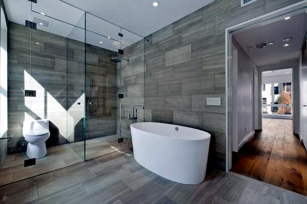
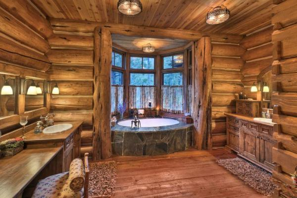
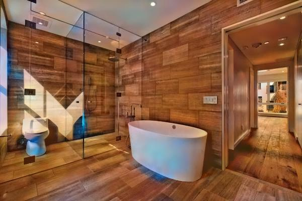

# Home Staging Using Machine Learning Techniques

## Abstract
Home Staging concept is a set of techniques that allow to achieve more attractive aspect for the possible buyers of a building. In other words, the goal is to make the buyer feel at home when he tours the property. Home Staging is popular because it provides the buyer with an idea of how the furniture could be placed in the different spaces of the house and even, which is the best style according to the specific interests of each client.

The main idea on which this project is based, focuses on a tool concept with the purpose of give the opportunity to a possible client of a house, to preview how would be the empty rooms, bathroom or dining room with some type of virtual decoration, furniture and basic elements with a concrete style.

In particular, this project attempts to undertake a research of an specific part, which consist in analysis of changing the style of 2D images, specifically in bathroom images. So, using matching learning, deep learning techniques and other post-processing systems, we tried to modify the style (rustic, modern, asian, minimalist, etc.) of different bathroom images.
This means that, without adding, deleting and even without changing the objects of the bathroom image, we are able to change the style of the furniture and walls.

In this document we will explain an approach using Convolutional Neural Networks to extract the style features from an image and replace them with another style. Moreover, improvements for this method and other systems are exposed. 

## Thesis Report
[This thesis report](2018TFG_Marti_Grau_vf.pdf) explain an approach using Convolutional Neural Networks to extract the style features from an image and replace them with another style. Morover, a Classifier is trained with the objective of distinguish between bathroom styles. This classifier hasbeen useful to create another way to measure our results apart from our subjective measure.

We provide PyTorch implementations for these methods.

# Data Base
We created bathroom images of 3 different Styles:
- Rustic
- Minimalist
- Classic

We used Google image to extract all our DataSet using a small [Python code](DataBase(FromGoogle)) to automatically dowload the images.
# Classifier
Taking advantage of [Transfer Learning technique](classifier) we pre-trained a classifier system to distinguish between bathroom styles.

We have our trained net in (2nd_mymodel_conv.pt) so we should run:

# Style Transfer and Post processing systems
Using Leon A. Gatys algorithm plus post processing systems to make reult image more photo-realistic we obtained:

# Style Transfer with multireference
Style Transfer method use only one image for style extraction. For this reason, we thought about improving the Style Transfer method, trying to addsome system to consider not only one style image, but considering a large data set of style imagefrom the same style.

Only this code is developed with caffemodel.

# CycleGAN
Morover, we implemented another system provided by [Jun-Yan Zhu](https://github.com/junyanz) and [Taesung Park](https://github.com/taesung89), and supported by [Tongzhou Wang](https://ssnl.github.io/) in which they obtain quality results changing the style domain of an image to another style domain.
Their method uses a type of neural network currently new and with impressive results (GAN's) Generative Adversarial Networks.
